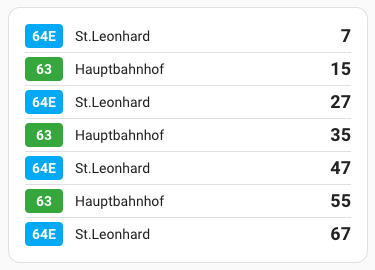

# Powerhaus Steiermark Öffi Card - Home Assistant Lovelace Card

[](https://github.com/hacs/integration)

A beautiful, customizable Lovelace card for displaying real-time public transit departure information from the [PH Steiermark Öffi Integration](https://github.com/gregor-autischer/PH_Steiermark_Oeffi).



## Features

- 🎨 **Clean, modern design** - Compact display with line badges and departure minutes
- 🎯 **Real-time status indicators** - Color-coded departure times indicate data source and delays
- 🔢 **Configurable departure count** - Display 1-7 departures
- 🌈 **Custom line colors** - Assign specific colors to transit lines
- ⚡ **Visual configuration UI** - Easy setup through Home Assistant's UI

## Prerequisites

This card requires the [PH Steiermark Öffi Integration](https://github.com/gregor-autischer/PH_Steiermark_Oeffi) to be installed and configured first. The integration provides the sensor entities that this card displays.

## Installation

### Option 1: HACS (Recommended)

1. Ensure [HACS](https://hacs.xyz/) is installed
2. Add this repository as a custom repository:
   - HACS → Frontend → Menu → Custom repositories
   - Repository: `https://github.com/gregor-autischer/PH_Steiermark_Oeffi_Card`
   - Category: `Dashboard`
3. Click "Install"
4. Add the resource (if not automatically added):
   - Settings → Dashboards → Resources → Add Resource
   - URL: `/hacsfiles/PH_Steiermark_Oeffi_Card/steirische-linien-card.js`
   - Type: JavaScript Module
5. Restart Home Assistant

### Option 2: Manual Installation

1. Download `steirische-linien-card.js` from the [latest release](https://github.com/gregor-autischer/PH_Steiermark_Oeffi_Card/releases)
2. Copy it to your Home Assistant `config/www/` directory
3. Add the resource:
   - Settings → Dashboards → Resources → Add Resource
   - URL: `/local/steirische-linien-card.js`
   - Type: JavaScript Module
4. Restart Home Assistant

## Configuration

### Using the Visual Editor

1. **Add the card** to your dashboard:
   - Edit Dashboard → Add Card → Search "PH Steiermark"
   - Or Manual card → Type: `custom:steirische-linien-card`

2. **Configure options** through the visual editor:
   - **Number of departures**: Select how many departures to display (1-7)
   - **Line colors**: Assign custom colors to specific transit lines

### YAML Configuration

#### Basic Configuration

```yaml
type: custom:steirische-linien-card
```

This will display all 7 departures with default styling.

#### Advanced Configuration

```yaml
type: custom:steirische-linien-card
departure_count: 5  # Number of departures to show (1-7, default: 7)
line_colors:        # Custom colors for specific lines
  - line: "64"
    color: "#FF5722"
  - line: "40"
    color: "#4CAF50"
  - line: "33"
    color: "#2196F3"
```

### Configuration Options

| Option | Type | Default | Description |
|--------|------|---------|-------------|
| `departure_count` | number | 7 | Number of departures to display (1-7) |
| `line_colors` | array | [] | Custom colors for specific transit lines |

#### Line Colors Configuration

Each line color entry requires:
- `line`: The line number/name as a string (e.g., "64", "5E")
- `color`: Hex color code (e.g., "#FF5722")

## Display Features

### Departure Information

Each departure shows:
- **Line badge** - Transit line number with custom color (if configured)
- **Destination** - Direction/final stop
- **Minutes** - Time until departure

### Status Indicators

Minutes are color-coded to indicate data quality:
- **Black** - Live departure time (real-time data available)
- **Orange** - Scheduled departure time (no real-time data available)  
- **Red** - Delayed departure (live data showing delay from schedule)

## Examples

### Minimal Setup

Just add the card with default settings:

```yaml
type: custom:steirische-linien-card
```

### Custom Colors for Specific Lines

```yaml
type: custom:steirische-linien-card
departure_count: 5
line_colors:
  - line: "64"
    color: "#E91E63"  # Pink
  - line: "40"
    color: "#4CAF50"  # Green
  - line: "5"
    color: "#FF9800"  # Orange
```

### Single Departure Display

For a minimal widget showing only the next departure:

```yaml
type: custom:steirische-linien-card
departure_count: 1
```

### Full Configuration

```yaml
type: custom:steirische-linien-card
departure_count: 7
line_colors:
  - line: "64"
    color: "#F44336"
  - line: "40"
    color: "#4CAF50"
  - line: "33"
    color: "#2196F3"
  - line: "5"
    color: "#FF9800"
  - line: "7"
    color: "#9C27B0"
```

## Styling

The card uses Home Assistant's theme variables for consistent appearance:
- `--primary-color` - Default line badge color
- `--primary-text-color` - Main text color
- `--secondary-text-color` - Secondary information
- `--divider-color` - Row separators
- `--error-color` - Delayed departures (red)
- `--warning-color` - Scheduled-only data (orange)

## Troubleshooting

### Card not appearing

1. Clear browser cache
2. Verify the resource is added correctly in Dashboard settings
3. Check browser console for errors (F12)
4. Ensure the integration is installed and sensors are working

### No departures shown

1. Verify the integration is configured and running
2. Check that sensor entities exist (`sensor.transit_departure_1` through `sensor.transit_departure_7`)
3. Ensure sensors have valid data in Developer Tools → States

### Colors not applying

1. Ensure line names match exactly (case-sensitive)
2. Use valid hex color codes (e.g., "#FF5722")
3. Try refreshing the page after configuration changes

## Development

### Building from Source

```bash
# Clone the repository
git clone https://github.com/gregor-autischer/PH_Steiermark_Oeffi_Card.git
cd PH_Steiermark_Oeffi_Card

# The card is a single JavaScript file - no build process required
# Make your changes to steirische-linien-card.js

# Test in Home Assistant by copying to www folder
cp steirische-linien-card.js /config/www/
```

### Contributing

Contributions are welcome! Please:
1. Fork the repository
2. Create a feature branch
3. Make your changes
4. Test thoroughly
5. Submit a pull request

## License

Apache License 2.0 - see the [LICENSE](LICENSE) file for details.

## Credits

This card is designed to work with the [PH Steiermark Öffi Integration](https://github.com/gregor-autischer/PH_Steiermark_Oeffi) for Home Assistant.